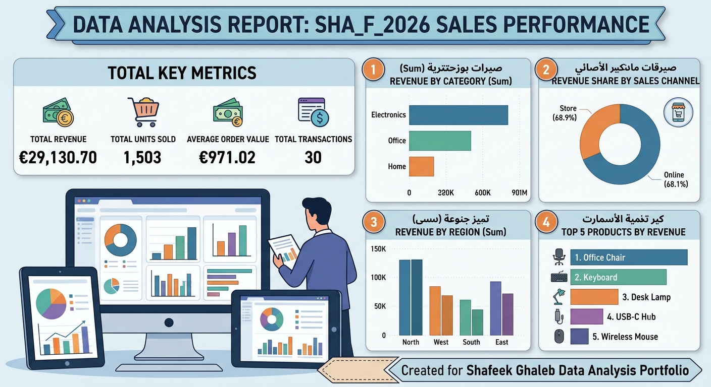

# 📊 Sales Data Analysis Project

## 📝 Overview
This project presents an end-to-end sales performance analysis using Python and Power BI, structured as part of the data analysis portfolio by Shafeek Ghaleb.

## 🔑 Key Performance Indicators (KPIs)
- **Total Revenue:** €29,130.70
- **Total Units Sold:** 1,503
- **Average Order Value:** €971.02
- **Total Transactions:** 30

---

## 📈 Visualizations

---

## 📊 Performance Breakdown

### 1. Revenue by Category
| Category | Revenue (€) | Percentage |
| :--- | :---: | :---: |
| **Electronics** | €12,590.20 | 43.2% |
| **Office** | €11,714.00 | 40.2% |
| **Home** | €4,826.50 | 16.6% |

### 2. Revenue by Region
| Region | Revenue (€) | Percentage |
| :--- | :---: | :---: |
| **North** | €8,427.80 | 28.9% |
| **West** | €7,748.20 | 26.6% |
| **South** | €6,771.20 | 23.2% |
| **East** | €6,183.50 | 21.2% |

### 3. Revenue by Sales Channel
| Channel | Revenue (€) | Percentage |
| :--- | :---: | :---: |
| **Online** | €20,075.50 | 68.9% |
| **In-Store** | €9,055.20 | 31.1% |

### 4. Top Products by Revenue
1. **Office Chair:** €9,282.00
2. **Keyboard:** €5,710.90
3. **Desk Lamp:** €4,826.50
4. **USB-C Hub:** €3,734.30
5. **Wireless Mouse:** €3,145.00
6. **Notebook:** €2,432.00

---

## 💡 Key Insights & Recommendations
1. **Online Dominance:** Online sales account for nearly 69% of total revenue. Focus digital marketing strategies to further capitalize on this channel.
2. **Category Strengths:** Electronics and Office supplies combined drive over 83% of total revenue.
3. **Regional Performance:** The North region is the top performer (€8.4K), with stable distribution across all other territories.

---
*Created by Shafeek Ghaleb | Data Analysis Portfolio*
- Which categories perform best?
- Are there noticeable monthly or seasonal patterns?

## Project Status

In progress.
